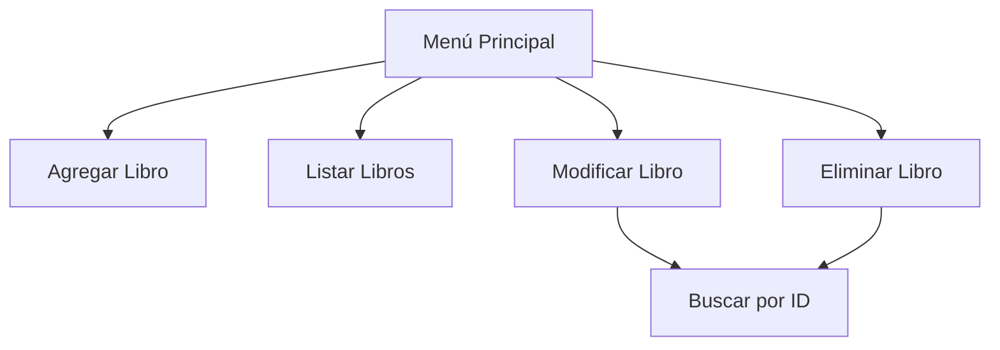

# Proyecto de Gestión de Biblioteca
Nombre: Benjamin Vivero

Seccion: 2
# Sistema de Biblioteca con Patrones de Diseño

Este proyecto implementa un sistema de gestión de biblioteca utilizando patrones de diseño para mejorar su estructura y funcionalidad.

## Patrones Implementados

### 1. Singleton (Biblioteca.java)
- **Función**: Garantizar una única instancia global de la biblioteca
- **Implementación**:
  ```java
  private static Biblioteca instancia;
  private Biblioteca() {}
  
  public static Biblioteca getInstancia() {
      if (instancia == null) {
          instancia = new Biblioteca();
      }
      return instancia;
  }
  ```
- **Beneficios**: Acceso centralizado y consistente a los recursos de la biblioteca

### 2. Prototype (Libro.java)
- **Función**: Permitir clonación de objetos libro existentes
- **Implementación**:
  ```java
  public abstract Libro clonar();
  
  // En LibroFisico:
  @Override
  public Libro clonar() {
      try {
          return (LibroFisico) this.clone();
      } catch (CloneNotSupportedException e) {
          return null;
      }
  }
  ```
- **Beneficios**: Creación eficiente de nuevos objetos basados en existentes

### 3. Bridge (Formato.java)
- **Función**: Separar la representación del libro de su formato de visualización
- **Implementación**:
  ```java
  interface Formato {
      String mostrar(Libro libro);
  }
  
  class FormatoSimple implements Formato { ... }
  class FormatoCompleto implements Formato { ... }
  ```
- **Beneficios**: Flexibilidad para añadir nuevos formatos sin modificar la estructura del libro

## Flujo del Sistema


## Funcionalidades Clave
1. **CRUD Completo**:
   - Creación: `agregarLibro()`
   - Lectura: `listarLibros()`, `obtenerLibro()`
   - Actualización: `modificarLibro()`
   - Eliminación: `eliminarLibro()`

2. **Gestión de Estado**:
   - Persistencia en memoria mediante `HashMap`
   - Validación de existencia previa a operaciones

## Ejecución
1. Compilar:
   ```bash
   javac SistemaBiblioteca.java
   ```
2. Ejecutar:
   ```bash
   java SistemaBiblioteca
   ```

## Mejoras Futuras
- Implementar persistencia en base de datos
- Añadir soporte para formatos de exportación (PDF, CSV)
- Implementar búsquedas avanzadas por autor o año
- Es útil cuando la creación de un objeto es costosa o compleja. Permite crear copias a partir de un objeto existente, lo que simplifica la instanciación de nuevos objetos similares.

